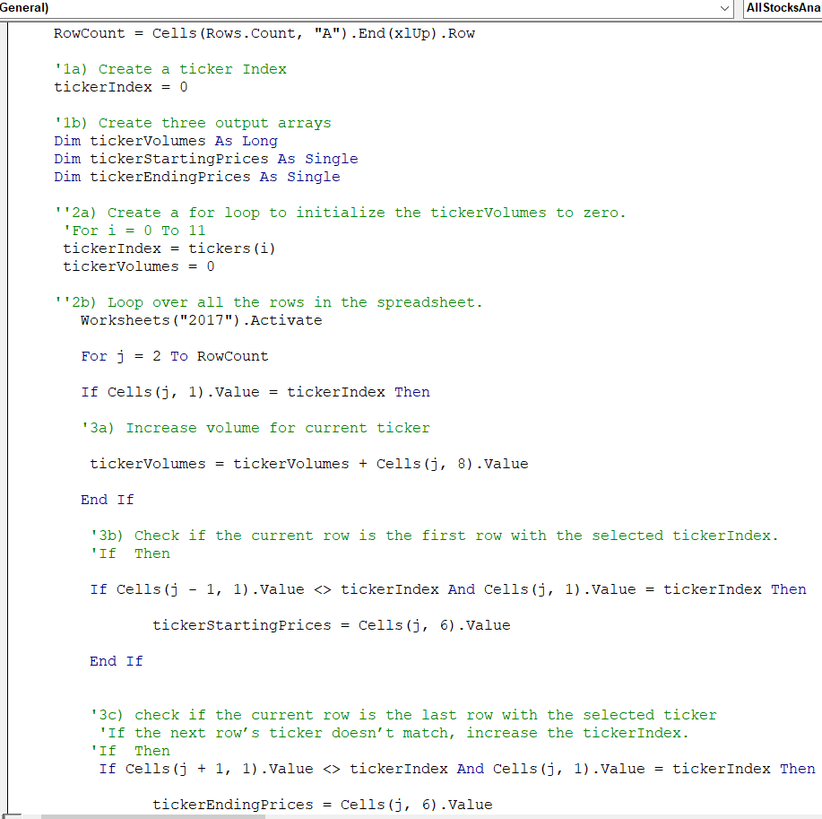
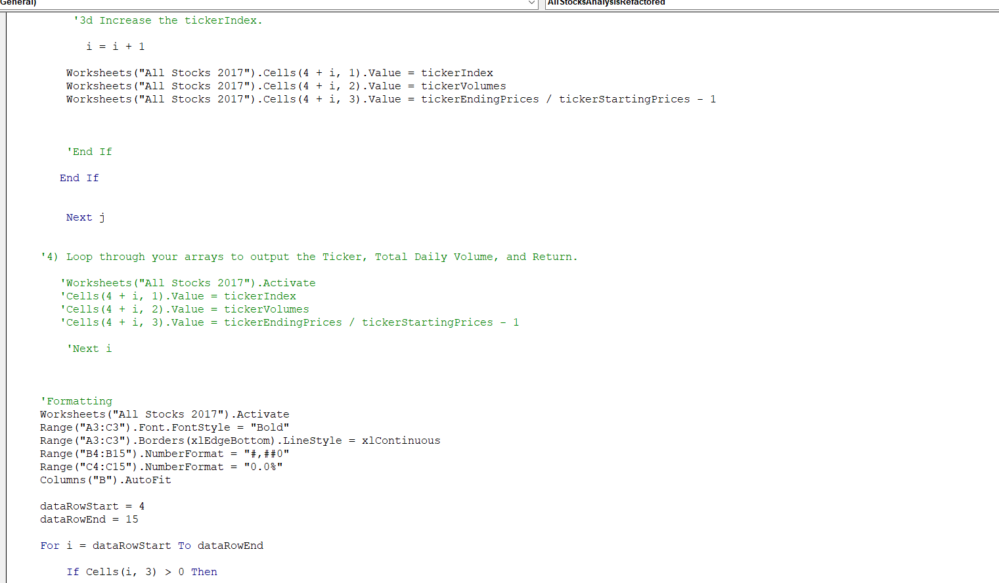
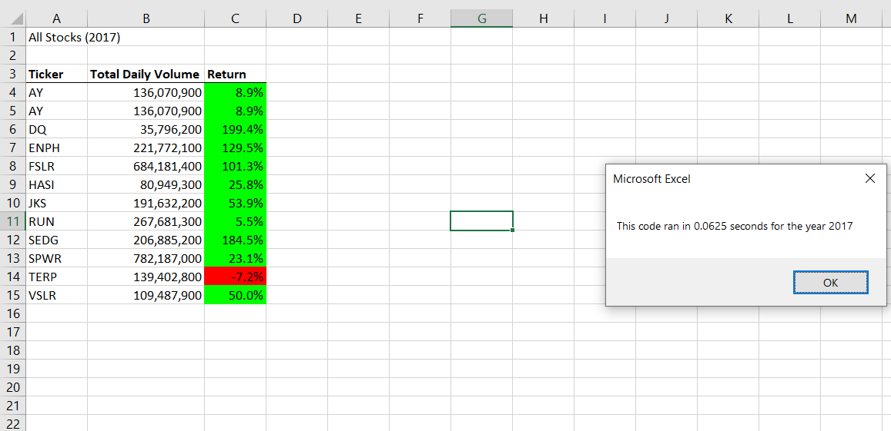

# Written Analysis on Stock data by using VBA
## Overview of Project and the purpose of this Analysis.
   The purpose of this project is to prepare a workbook to Steve by refactoring the Stock market Dataset with VBA solution code to loop through all the data one time in order to collect certain stock information in the year 2017 and 2018. In this Analysis, we will determine whether refactoring our code successfully made the VBA script run faster and make the code more efficient be taking fewer steps, using less memory, or improving the logic of the code to make it easier. So, this process was originally completed in a similar format, however, the goal for this round is to increase the efficiency of the original code. 
   The data that is presented includes two charts with stock information on 12 different stocks. The stock information contains a ticker value, the date the stock was issued, the opening, closing and adjusted closing price, the highest and lowest price, and the volume of the stock. The goal is to retrieve the ticker, the total daily volume, and the return on each stock.
   
## Results: Using images and examples of your code, compare the stock performance between 2017 and 2018, as well as the execution times of the original script and the refactored script.

    To perform this Analysis I copied the code that was needed to create the input box, chart headers, ticker array, and to activate the appropriate worksheet. The steps were then listed out in order to set the structure for the refactoring. Below is the instruction and code as written in the file.  

 

Finally, when I run the macro for both years to confirm that our stock analysis outputs, a message box similar to the images below popped up and showed the elapsed time for 2017 and 2018. Running our fully 2017 and 2018 data stock analysis gave us an elapsed run time for each year, below our results. Finally, the biggest benefit that occurred as a result of the refactoring was an decrease in macro run time. The original analysis took approximately one second to run, whereas our new analysis only took about a 6 of the time (approximately 0.25 seconds) to run. Attached above are the screenshots that indicate the run time for our new analysis.

In addition, in our resources folder and below you can see the final Stock Analysis Results by pop-up messages showing the elapsed run time for the script are saved as VBA_Challenge_2017.png and VBA_Challenge_2018.png and the outputs for the 2017 and 2018 stock analyses in the VBA_Challenge.xlsm workbook match the outputs from the AllStockAnalysis in the module.

   ##  Summary: 
   
   ### The Advantages of Refactoring Stock Analysis

    First off all, logical errors easily appear in well structure code that contains nested conditionals and loops.
In our case, using Excel flow displays program logic in a more comprehensible manner, not tied to the order that the underlying code is written. Then, VBA interpretation (Excel) of code can reveal patterns that are not easy to see in the source. 

  ### Disadvantages:

    A long procedure may contain the same line of code in several locations, you can change the logic to eliminate the duplicate lines. A logical structure may be duplicated in two or more procedures (possibly via copy & paste coding). When detected, this logic is best moved to a new function and called from the other functions.
A complex unstructured code is usually best to split in several functions.
Refactoring process can affect the testing outcomes.

## Pros and Cons of Refactoring Code

     Refactoring helps make our code cleaner and more organized. A few advantages of a cleaner code include design and software improvement, debugging, and faster programming. It may also benefit other users who view our projects because it becomes easier to read, as it is more concise and straightforward. However, we do not always have the luxury to refactor our code due to disadvantages. These disadvantages may range from having applications that are too large to not having the proper test cases for the existing codes, which may ultimately pose some risk if we try to refactor our code.

Improving or updating the code without changing the software’s functionality or external behavior of the application is known as code refactoring. Now, let's think about something, What happens after a couple of days or months yo need to troubleshoot your code? Is it complicated? Is it hard to understand? If yes then definitely you didn’t pay attention to improve your code or to restructure your code.

We need to consider the code refactoring process as cleaning up the orderly house. Unnecessary clutter in a home can create a chaotic and stressful environment. - The same goes for written code.

You need to perform code refactoring in small steps. Make tiny changes in your program, each of the small changes makes your code slightly better and leaves the application in a working state.

